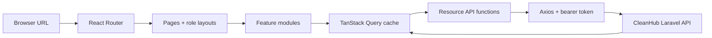

<div align="center">

<h1>🧹 CleanHub</h1>

<h3>A focused job marketplace for the people who keep every other workplace moving.</h3>

<p><strong>React 19 · Vite 8 · TanStack Query · React Router · Tailwind CSS</strong></p>

<p><a href="https://github.com/murhee-ia/cleanhub-laravel">Backend repository</a> · <a href="docs/api.md">Frontend API guide</a> · <a href="docs/architecture.md">Architecture guide</a> · <a href="docs/testing.md">Testing guide</a></p>

</div>

---

## Table of contents


- [Meet CleanHub](#meet-cleanhub)
- [What this repository does](#what-this-repository-does)
- [Who CleanHub serves](#who-cleanhub-serves)
- [The CleanHub journey](#the-cleanhub-journey)
- [Current experience](#current-experience)
- [Rules reflected in the interface](#rules-reflected-in-the-interface)
- [Frontend stack](#frontend-stack)
- [How the frontend is arranged](#how-the-frontend-is-arranged)
- [Run it locally](#run-it-locally)
- [Explore with demo accounts](#explore-with-demo-accounts)
- [Useful development commands](#useful-development-commands)
- [Documentation library](#documentation-library)
  - [Frontend API guide](docs/api.md)
  - [Architecture guide](docs/architecture.md)
  - [Testing and verification guide](docs/testing.md)
- [Companion backend](#companion-backend)
- [Portfolio disclaimer](#portfolio-disclaimer)

## Meet CleanHub


Cleaning work is everywhere, but finding the right opportunity—or the right
person for it—still too often happens through generic listings and scattered
conversations. CleanHub gives that work a platform designed around its actual
journey.

A guest can begin with nothing more than curiosity and immediately see public
opportunities. A cleaner can shape experience, documents, preferred categories,
and completed work into a professional presence. An employer can turn a need
into a structured listing and move through applicants without losing the
details that make a decision human. When a relationship is complete, both
parties carry its trust signals forward.

Cleaning is the product domain—not a label placed on a generic checkout app.
Residential, hotel, hospital, office, factory, research, public-space, and event
work can share a clear recruitment flow while retaining meaningful differences
in category, schedule, location, requirements, and profile context.

CleanHub deliberately stops at recruitment and reputation. A post can display
compensation information, but the platform does **not** collect payments,
distribute salaries, generate contracts, invoice users, or manage payroll.
Cleaners and employers arrange those matters outside the platform.

CleanHub is delivered by two cooperating repositories:

| Repository | Responsibility |
|---|---|
| **`cleanhub-react`** — this repository | Responsive SPA, public discovery, role-aware navigation, forms, server-state UX, calendars, moderation, and administration screens |
| [`cleanhub-laravel`](https://github.com/murhee-ia/cleanhub-laravel) | Versioned REST API, bearer authentication, policies, validation, persistence, uploads, queues, notifications, scheduled work, and tests |

## What this repository does


This app is CleanHub's front door, workspace, calendar, and control room. It
turns the API's domain into an experience that feels approachable for someone
browsing their first job and dependable for someone managing an entire report
queue.

For developers, that experience is deliberately layered. Pages own route-level
states, feature modules own domain interactions, shared components keep the
visual language consistent, and thin API modules send every request through one
authenticated Axios client. New surfaces can join the product without inventing
a second way to fetch data, protect a route, validate a form, or represent a
status.



The UI uses a warm neo-brutalist design: a parchment grid background, white
paper-like surfaces, dark 2px borders, hard offset shadows, and strong green and
yellow accents. It gives CleanHub a recognizable voice without competing with
the information users need to make decisions. Responsive role navigation then
reshapes that workspace across desktop, tablet, and mobile widths.

## Who CleanHub serves


The interface reveals capability as each user takes on more responsibility:

| Role | The experience CleanHub creates |
|---|---|
| **Guest** | An open invitation to explore: public home, searchable/filterable jobs, sorting, and published job details before registration is required |
| **Cleaner** | A personal opportunity workspace: job discovery, saved work, applications by status, accepted-work calendar, profile and document tools, employer context, completion proof, ratings, reports, and notifications |
| **Employer** | A recruitment workspace that keeps every job coherent: profile, drafts, published posts, job details, applicant review, private notes, decisions, cleaner context, completion proof, ratings, reports, and notifications |
| **Moderator** | A focused safety desk: protected report queue, filters, evidence/context, resolution or rejection, content hiding, user warnings, and escalation |
| **Admin** | A wider operating picture: overview metrics plus user, job, category, moderator, platform-setting, and audit-history screens |

Only cleaner and employer roles appear in self-registration. Moderator accounts
are created by the admin; the single admin account is provisioned by the backend.

## The CleanHub journey


The interface is designed around momentum: each step should make the next
decision clearer without hiding the rules that protect both sides.

```text
DISCOVER        DECIDE          CONNECT           COMPLETE          BUILD TRUST
public jobs  →  save/apply  →   accept/reject  →  proof upload  →  mutual ratings
                                 + calendar          per party        + reviews
```

1. A guest browses open, published cleaning jobs without meeting a registration
   wall.
2. A cleaner registers, verifies their email, completes a profile, and saves or
   applies to relevant work.
3. The employer opens that job's applicant workspace, reviews the cleaner's
   application/profile, and accepts or rejects them.
4. Acceptance turns an application into scheduled work on the cleaner's monthly
   calendar.
5. Cleaner and employer record completion independently with image/PDF proof.
6. Each party can rate the other after satisfying their own completion rule,
   turning one completed relationship into context for the next.
7. Authenticated users can report a user, job, or rating; moderators and the
   admin handle the resulting queue.

## Current experience


The current UI connects the main product journey rather than presenting a set
of disconnected mock screens. Shared query data and role-aware paths let the
same relationship stay recognizable as users move between feeds, detail pages,
applications, calendars, profiles, and dashboards.

### Discovering work

- Guest and cleaner job feeds make opportunity visible immediately, with
  pagination for a growing catalogue.
- Keyword search plus category, country, city, and date filters.
- Sort controls and URL-backed filter state, so a filtered view survives refresh.
- Public job details and role-aware detail links that preserve the signed-in
  user's sidebar.
- Optimistic save/unsave interactions make a cleaner's shortlist feel immediate
  while the API remains authoritative.

### Applying and hiring

- Application modal combines an optional word-counted message and optional PDF
  resume with the wider profile an employer can inspect.
- Proactive schedule-overlap warning plus distinct handling of the backend's
  authoritative `409` conflict response.
- Cleaner application tabs for pending, accepted, rejected, withdrawn, and
  completed relationships.
- Employer applicant table/drawer keeps profile context, resume, decision
  message, accept/reject controls, and employer-only notes attached to the job
  where they matter.
- FullCalendar monthly view generated from accepted/completed applications.

### Completing and reviewing

- Separate proof-upload dialogs give cleaner application completion and employer
  job-post completion equal visibility without letting either party speak for
  the other.
- Image/PDF selection guidance and server validation feedback.
- 1–5 star rating form with optional review text.
- Persistent `viewer_has_rated` behavior, visible-rating summaries, and paginated
  review sections let completed work become useful reputation rather than a
  forgotten status.

### Staying informed and keeping the platform healthy

- Notification bell with a 30-second unread poll, portal-rendered dropdown,
  mark-one/mark-all-read behavior, role-aware destinations, and a full
  notifications page keeps cleaners and employers close to decisions that may
  happen while they are elsewhere in the app.
- Report actions attached to reportable users, job posts, and ratings.
- Moderator report workspace makes resolve, reject, hide, warn, and escalate
  actions explicit rather than burying safety work inside generic controls.
- Admin dashboards for reversible user/content management, categories,
  moderator accounts, settings, summary counts, and audit history.

## Rules reflected in the interface


CleanHub's personality comes from the visual system, but its credibility comes
from consistency. These interface rules mirror backend guarantees so the user
is guided toward actions the platform can actually honor:

- **Backend policies remain authoritative.** `ProtectedRoute` and hidden buttons
  guide users, but they are not security boundaries.
- **Auth is a bearer-token session.** `access_token` and `auth_user` are kept in
  `localStorage`; Axios adds the token, and a `401` clears local session and
  query data before redirecting to login.
- **Applications are unique and durable.** Once a cleaner has applied, the UI
  does not offer a second application—even after rejection or withdrawal.
- **Calendar means accepted work.** Saving or merely applying does not create an
  event.
- **Completion is independent.** Cleaner and employer actions update different
  records and can happen in either order.
- **Ratings are relationship-bound.** The API decides whom the authenticated
  reviewer may rate and whether the action is unlocked.
- **No payment flow exists.** Compensation is display-only.

## Frontend stack


| Technology | Version in this repository | How CleanHub uses it |
|---|---:|---|
| **JavaScript / ESM** | `type: module` | Application source and build configuration without a TypeScript compilation layer |
| **React** | `^19.2.7` | Component rendering, context, local interaction state, and portal-based overlays |
| **Vite** | `^8.1.1` | Development server, hot updates, environment variables, and production bundling |
| **React Router** | `^7.18.1` | Browser routing in library mode, nested role layouts, route parameters, and UX-only guards |
| **TanStack Query** | `^5.101.2` | Server-state fetching, pagination continuity, cache key factories, invalidation, optimistic updates, and notification polling |
| **Axios** | `^1.18.1` | Shared HTTP client with API base URL, bearer-token request handling, and global `401` cleanup |
| **Tailwind CSS** | `^4.3.3` | CSS-first utilities and the `@theme` design-token palette through the Vite plugin |
| **React Hook Form** | `^7.81.0` | Form registration, submission state, and field/server errors |
| **Zod + resolvers** | Zod `^4.4.3` | Client schemas aligned with backend validation and connected to React Hook Form |
| **FullCalendar** | `^6.1.21` | Cleaner monthly calendar and clickable accepted/completed job events |
| **Lucide React** | `^1.25.0` | Individually imported interface icons |
| **ESLint** | `^10.6.0` | Static checks for JavaScript, React Hooks, and fast-refresh boundaries |

## How the frontend is arranged


```text
src/
├── api/          one Axios client and thin functions grouped by API resource
├── components/   shared visual primitives, navigation, guards, and tables
├── context/      persisted authentication provider
├── features/     domain UI for jobs, applications, calendar, profiles,
│                 ratings, notifications, reports, moderation, and admin
├── hooks/        cross-feature hooks
├── layouts/      auth and role-specific route shells
├── lib/          query client, schemas, constants, and shared helpers
├── pages/        route-level compositions
├── index.css     Tailwind import, tokens, responsive layout, and visual system
├── main.jsx      React/query/router provider entry point
└── router.jsx    public, auth, cleaner, employer, moderator, and admin routes
```

For why these layers exist and how data crosses them, read the
[architecture guide](docs/architecture.md).

## Run it locally


### 1. Prerequisites

Install:

- Git
- Node.js `^20.19.0` or `>=22.12.0` (required by Vite 8)
- npm (included with Node.js)
- A running copy of the
  [CleanHub Laravel API](https://github.com/murhee-ia/cleanhub-laravel)

The backend should normally be available at
`http://localhost:8000/api/v1`. Its queue worker is required for queued
notifications to appear.

### 2. Clone and install dependencies

```bash
git clone https://github.com/murhee-ia/cleanhub-react.git
cd cleanhub-react
npm ci
```

`npm ci` installs the dependency versions represented by `package-lock.json`
and starts from a reproducible dependency tree.

### 3. Connect the API

Create a local `.env` file at the repository root:

```dotenv
VITE_API_URL=http://localhost:8000/api/v1
```

Only variables prefixed with `VITE_` are exposed to browser code. Do not place
secrets in frontend environment files; a browser bundle cannot keep them secret.

### 4. Start the development server

```bash
npm run dev
```

Open the URL printed by Vite, normally `http://localhost:5173`. Keep the backend
API and its queue worker running in separate terminals.

### 5. Confirm the frontend is healthy

```bash
npm run lint
npm run build
```

`lint` checks the source; `build` verifies that imports, JSX, Tailwind, and the
production bundle compile. There is currently no Vitest, React Testing Library,
or Playwright suite in this repository, so follow the browser and API walkthrough
in [docs/testing.md](docs/testing.md) for runtime verification.

### 6. Preview the production bundle (optional)

```bash
npm run preview
```

Use the URL Vite prints to inspect the already-built `dist/` output locally.
This is a preview server, not a production deployment process.

## Explore with demo accounts


When the backend has been migrated and seeded, it provides verified development
accounts. The demo cleaner/employer password is `password`.

| View | Account to try |
|---|---|
| Cleaner experience | `cleaner1@demo.test` |
| Employer experience | `employer1@demo.test` |
| Admin experience | The `ADMIN_EMAIL` and `ADMIN_PASSWORD` configured in the backend before seeding |

Additional cleaner/employer accounts and sample jobs are created by the backend
seeders. No moderator is seeded; create one from the admin interface when you
want to inspect the moderation workspace. These credentials are strictly for
local development.

## Useful development commands


| Command | Purpose |
|---|---|
| `npm run dev` | Start the Vite development server with hot updates |
| `npm run lint` | Run ESLint across the repository |
| `npm run build` | Generate the optimized `dist/` bundle |
| `npm run preview` | Serve the generated bundle for a local production-style preview |

## Documentation library


The README shows the product from the balcony. Choose a path below when you are
ready to walk through the machinery:

### 🔌 “How does this screen speak to CleanHub?”

> Trace payloads and response shapes from an API function into query state,
> forms, cards, calendars, notifications, and error handling.
>
> **[Follow the frontend API trail →](docs/api.md)**

### 🧭 “Why is the code arranged this way?”

> Move from `main.jsx` through providers, routes, layouts, pages, features,
> shared primitives, cache keys, and the design system. The map includes both
> where things live and why those boundaries matter.
>
> **[Tour the frontend architecture →](docs/architecture.md)**

### 🧪 “What should I try before I trust my change?”

> Start with lint and build, then walk the actual product in a browser: auth,
> discovery, applications, calendars, completion, ratings, notifications, and
> API smoke checks.
>
> **[Open the verification playbook →](docs/testing.md)**

## Companion backend


The source of truth for authentication, authorization, validation, persistence,
and domain behavior lives in
[`murhee-ia/cleanhub-laravel`](https://github.com/murhee-ia/cleanhub-laravel).
The frontend is useful on its own for studying component architecture, but both
repositories must run to use CleanHub end to end.

## Portfolio disclaimer


CleanHub is a **personal project created for learning, experimentation, and
portfolio presentation**. It demonstrates a full-stack product and its
engineering decisions; it is not presented as a commercial employment agency
or production marketplace. Do not use demo configuration for real users or
upload sensitive personal documents without completing an independent
production security, privacy, deployment, and legal review.
